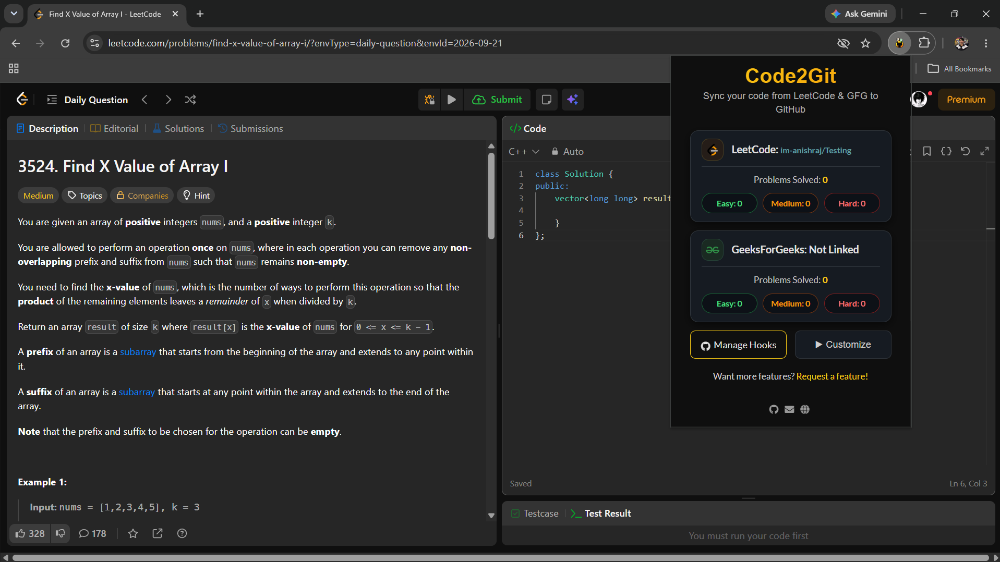

<div align="center">
  

  <h3>Your DSA grind, automatically committed.</h3>
  <p>Solve on LeetCode, LeetCode CN &amp; GeeksforGeeks — Code2Git turns every accepted solution into a GitHub commit, organized, labeled, and ready to show recruiters.</p>

  <p>
    <a href="https://github.com/im-anishraj/Code2Git/blob/main/LICENSE"></a>
    <a href="https://chromewebstore.google.com/u/1/detail/code2git/geodebjjkeochpcpjdkclmjbpkjbihnd"></a>
    <a href="https://chromewebstore.google.com/u/1/detail/code2git/geodebjjkeochpcpjdkclmjbpkjbihnd"></a>
    <a href="https://chromewebstore.google.com/u/1/detail/code2git/geodebjjkeochpcpjdkclmjbpkjbihnd"></a>
    <a href="https://github.com/im-anishraj/Code2Git/graphs/contributors"></a>
    <a href="https://github.com/im-anishraj/Code2Git/commits/main"></a>
    <a href="https://github.com/im-anishraj/Code2Git/stargazers"></a>
  </p>

  <p>
    <a href="#-installation"><b>Install</b></a> •
    <a href="#-features"><b>Features</b></a> •
    <a href="#-getting-started"><b>Getting Started</b></a> •
    <a href="#-roadmap"><b>Roadmap</b></a> •
    <a href="#-contributing"><b>Contributing</b></a>
  </p>
</div>

<br>

## 📖 Table of Contents

- [What is Code2Git?](#-what-is-code2git)
- [Why Developers Use It](#-why-developers-use-it)
- [Features](#-features)
  - [Fully Automated Syncing](#-fully-automated-syncing)
  - [Dashboard](#-dashboard)
  - [Smart Organization](#-smart-organization)
  - [Dynamic Commit Messages](#-dynamic-commit-messages)
  - [Version Control](#-version-control)
  - [Auto-Committed Solution Write-Ups](#-auto-committed-solution-write-ups)
- [Demo](#-demo)
- [Supported Platforms](#-supported-platforms)
- [How It Works](#-how-it-works)
- [Installation](#-installation)
- [Getting Started](#-getting-started)
- [Roadmap](#-roadmap)
- [FAQ](#-faq)
- [Contributing](#-contributing)
- [License](#-license)
- [Support](#-support)

## 🧠 What is Code2Git?

Code2Git is a Chrome extension that automatically commits your code to GitHub the instant you pass all tests on **LeetCode**, **LeetCode CN**, or **GeeksforGeeks** — fully organized, fully labeled, and styled exactly the way you want.

## 💡 Why Developers Use It

Solving problems is only half the story — the other half is proving you did it. Manually copying accepted solutions into GitHub is tedious, so most people stop after a week, and their contribution graph goes quiet even while they keep grinding.

Code2Git closes that gap. Solve the problem, and it's already on GitHub — organized, timestamped, and ready to show recruiters, teammates, or future you.

## ⚡ Features

### 🔄 Fully Automated Syncing

Works silently in the background across **LeetCode** and **GeeksforGeeks**. Pass the tests, and your solution is pushed — no copy-pasting, no remembering to commit.

### 📊 Dashboard

A premium dark-mode popup with a real-time breakdown of exactly how many **Easy**, **Medium**, and **Hard** problems you've solved — across both platforms, at a glance.

### 🗂️ Smart Organization

Your repo, organized the way you think about problems. Toggle auto-organization by:

**Difficulty**

```
LeetCode/
├── Easy/Two-Sum/
├── Medium/Add-Two-Numbers/
└── Hard/Median-of-Two-Sorted-Arrays/
```

**Language**

```
LeetCode/
└── JavaScript/
    ├── Easy/Two-Sum/
    └── Medium/Add-Two-Numbers/
```

### ✍️ Dynamic Commit Messages

Full control over how your commit history reads. Build your own template with:

| Variable        | Resolves to                         |
| --------------- | ----------------------------------- |
| `{problemName}` | The problem you solved              |
| `{difficulty}`  | Easy / Medium / Hard                |
| `{language}`    | Language used for the submission    |
| `{date}`        | Commit date                         |
| `{time}`        | Commit time                         |
| `{space}`       | A literal space, for custom spacing |

Example template:

```
✅ {problemName} ({difficulty}) — solved in {language}
```

becomes:

```
✅ Two Sum (Easy) — solved in JavaScript
```

### 🕐 Version Control

Turn on **Timestamped Filenames** to save every attempt at a problem as its own file — no more losing an earlier solution because you resubmitted.

### 📝 Auto-Committed Solution Write-Ups

Publish a solution post on LeetCode, and Code2Git saves it straight into the matching folder as a clean `Solution.md` — your explanations, version-controlled right alongside your code.

## 🎬 Demo

<h1 align="center">
    
</h1>

## 🌐 Supported Platforms

| Platform                                        | Status                                    |
| ----------------------------------------------- | ----------------------------------------- |
| [LeetCode.com](https://leetcode.com/)           | ✅ Supported                              |
| [LeetCode.cn](https://leetcode.cn/) (力扣)      | ✅ Supported                              |
| [GeeksforGeeks](https://www.geeksforgeeks.org/) | ✅ Supported                              |
| HackerRank                                      | 🚧 In progress — see [Roadmap](#-roadmap) |

## ⚙️ How It Works

1. You solve a problem and submit.
2. Code2Git detects the accepted submission.
3. Your code is formatted, named, and committed to your linked repo — instantly.

Missed one, or want to push an older submission? Select it and hit the **manual sync** button next to the notes icon — one click, done.

## 📥 Installation

### Chrome Web Store _(recommended)_

<div align="center">
    <a href="https://chromewebstore.google.com/u/1/detail/code2git/geodebjjkeochpcpjdkclmjbpkjbihnd" rel="Download Code2Git">
        
    </a>
</div>

Installs and updates itself automatically — this is the preferred way to get Code2Git.

### Manual Installation

1. Create your own OAuth app in GitHub → [github.com/settings/applications/new](https://github.com/settings/applications/new), and keep `CLIENT_ID` / `CLIENT_SECRET` confidential.
   - **Application name:** _(your choice)_
   - **Homepage URL:** `https://github.com/im-anishraj/Code2Git`
   - **Authorization callback URL:** `https://github.com/`
2. Download the project as a [release ZIP](https://github.com/im-anishraj/Code2Git/releases) or clone this repo.
3. Run `npm run setup` to install the developer dependencies.
4. Add your `CLIENT_ID` and `CLIENT_SECRET` to `src/js/authorize.js` and `src/js/oauth2.js`.
5. Go to [chrome://extensions](chrome://extensions) and enable Developer mode (top right).
6. Click **Load unpacked** and select the Code2Git folder.

## 🚀 Getting Started

1️⃣ **Authenticate** — Sign in with GitHub in one click.
2️⃣ **Link a Repo** — Connect an existing repo or create a new one (private by default).
3️⃣ **Start Coding** — Solve on LeetCode or GFG like normal. Code2Git handles the rest.

## 🗺️ Roadmap

- [x] LeetCode.com
- [x] LeetCode.cn
- [x] GeeksforGeeks
- [x] Dynamic commit messages
- [x] Timestamped filenames
- [ ] HackerRank _(in progress)_
- [ ] More platforms — [request one](https://github.com/im-anishraj/Code2Git/labels/feature)

## ❓ FAQ

<details>
<summary>Is my code kept private?</summary>
<br>
Yes — Code2Git links to a private repo by default. You're always in control of where your code goes.
</details>

<details>
<summary>Which platforms are supported right now?</summary>
<br>
LeetCode, LeetCode CN, and GeeksforGeeks today, with HackerRank in active development.
</details>

<details>
<summary>Can I control how my commits and folders look?</summary>
<br>
Completely. Customize commit messages with variables, and choose whether your repo is organized by difficulty or language — see <a href="#-dynamic-commit-messages">Dynamic Commit Messages</a> and <a href="#-smart-organization">Smart Organization</a>.
</details>

<details>
<summary>What if I resubmit a problem I've already solved?</summary>
<br>
Enable Timestamped Filenames and every attempt is saved as its own file — nothing gets overwritten.
</details>

## 🤝 Contributing

Contributions, issues, and feature requests are welcome — this project grows with its community.

| Command               | Description                        |
| --------------------- | ---------------------------------- |
| `npm run`             | Show available commands            |
| `npm run setup`       | Install dependencies               |
| `npm run format`      | Auto-format JavaScript, HTML/CSS   |
| `npm run format-test` | Test if code is formatted properly |
| `npm run lint`        | Lint JavaScript                    |
| `npm run lint-test`   | Test if code is linted properly    |

1. Fork the repo and create your branch from `main`.
2. Make your changes and run `npm run format` and `npm run lint`.
3. Open a pull request describing what you changed and why.

## 📄 License

Code2Git is [MIT licensed](https://github.com/im-anishraj/Code2Git/blob/main/LICENSE).

## ⭐ Support

Because your commit history should tell the real story. If Code2Git saves you time, star the repo — it helps other developers find it and keeps development moving.

<a href="https://github.com/im-anishraj/Code2Git/stargazers">
  
</a>
